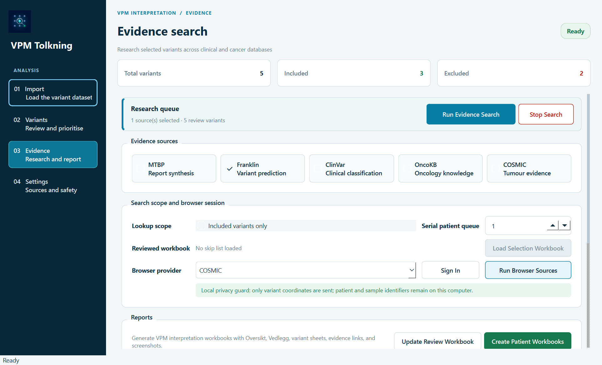
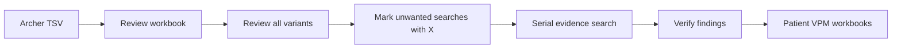

<p align="center">
  
</p>

<h1 align="center">Myolid Tolkning</h1>

<p align="center">
  A focused Windows workstation for somatic variant review, evidence collection,<br>
  and image-led VPM interpretation reports.
</p>

<p align="center">
  
  
  
  
  
</p>

<p align="center">
  
</p>

> [!IMPORTANT]
> Myolid Tolkning is a research and interpretation-support tool. Database findings
> and generated reports must be reviewed by qualified personnel before clinical use.

## What it does

Myolid Tolkning turns an Archer Analysis TSV export into a controlled review and
evidence workflow. It keeps variant selection, browser research, screenshots,
audit data, and patient workbooks connected without sending patient or sample
identifiers to the evidence providers.

| Capability | Result |
| --- | --- |
| Structured import | Validates Archer TSV exports and normalizes variant records |
| Local prioritisation | Applies configurable artifact rules and Archer `Tier I`, `Tier II`, and `Germ` counts |
| Review-first workflow | Produces a full Excel workbook where unwanted searches can be marked with `X` |
| Evidence collection | Searches MTBP, Franklin, ClinVar, OncoKB, and COSMIC in minimized Microsoft Edge sessions |
| Screenshot capture | Saves focused, variant-specific evidence images in a consistent order |
| Resumable analysis | Reopens a processed workbook with selections, evidence, and screenshot paths restored |
| Patient reporting | Creates one image-led interpretation workbook per DIT identifier |

## Workflow



1. Import an Archer variant TSV and create the review workbook.
2. Review **With Artifacts** and mark `X` in **Skip Database Search (X)** where appropriate.
3. Load the reviewed workbook back into the application.
4. Select the evidence sources and run the patient-by-patient search.
5. Verify the compact findings and captured source images.
6. Review the patient workbooks written automatically beside the main workbook.

Use **Pause Search** to pause at the next safe browser checkpoint and **Resume
Search** to continue the same queue without repeating completed work. **Stop
Search** ends the run, retains every completed provider result, and updates the
review workbook whenever it is writable. **Resume Incomplete Search** skips fully
completed patients and sources, while retrying errors, timeouts, and unfinished
work. Log lines include clock timestamps and completed/stopped runs include total
elapsed time.

Automated Edge windows run minimized by default so the workstation remains usable.
Manual **Sign In** windows still open visibly. Variant-to-variant pacing remains
randomized according to Settings; switching between providers uses a fixed 3-second
transition.

The desktop interface is organised as an operations cockpit. A persistent strip
distinguishes Ready, Running, Paused, Interrupted, Complete, Retry available, and
Report save pending. The Evidence workspace keeps the current task, a
patient-by-provider matrix, and timestamped activity visible. Startup can offer
the most recent local workbook, but it never loads data or contacts a provider
until **Restore analysis** is selected. **Retry Pending Saves** retries only
locked report files and never repeats database searches.

## Evidence sources

All browser sources are queried with the somatic workflow and GRCh37/hg19 where
the provider exposes that choice.

| Source | Capture strategy | Key safeguards |
| --- | --- | --- |
| **MTBP** | One pseudonymous report per variant and one alteration-centric screenshot | Transcript HGVS first, then a validated GRCh37 genomic fallback; returned variant identity is checked; personal report URLs are not exported |
| **Franklin** | Classification-only ACMG/Oncology overviews, each named evidence card, Predictions, and Population Frequencies | Explicit **hg19** + **Somatic** search; clipped evidence cards are expanded for full capture; ACMG stops after De Novo Data; Somatic Clinical Evidence and Add More Evidence are excluded |
| **ClinVar** | Variant title and focused germline/somatic classification summary | Opens a candidate only after chromosome, VCF position, reference, alternate, and **GRCh37** assembly all match exactly; older unverified results are queued for verification |
| **OncoKB** | Variant Overview and Mutation Effect | Rejects the cookie overlay before taking the screenshot |
| **COSMIC** | Overview, Tissue distribution, and Samples filtered to `lymphoid` | Uses the Archer `COSMICID` and resolves the canonical GRCh37 mutation page |

Patient report images are embedded in this order:

1. MTBP
2. Franklin
3. ClinVar
4. OncoKB
5. COSMIC

## Why direct Edge control?

The application controls the installed Microsoft Edge browser through the local
Edge DevTools Protocol (CDP). The browser is started and automated directly from
Python using a local WebSocket connection.

This design requires no:

- Playwright or Node.js
- Selenium or Selenium Manager
- separate Edge WebDriver executable

Each provider receives its own persistent Edge profile under
`%USERPROFILE%\.archer-prosess\browser_profiles`. This allows signed-in sessions
to be reused while keeping browser activity visible and auditable.

> [!WARNING]
> Browser profiles contain authenticated session data. Do not copy, share, or
> commit the profile directory. Managed Edge must permit local remote debugging.

## Operational safeguards

- Evidence searches run serially, one patient at a time.
- Selected websites finish for one patient before the next patient begins.
- Randomized safety buffers default to 10–20 seconds between browser actions.
- MTBP runs last and has a separately configurable report timeout.
- MTBP submissions use application-generated pseudonymous identifiers only.
- Completed patient evidence is saved throughout the run, not only at the end.
- Cooperative cancellation is checked during provider loops, safety buffers,
  Franklin rendering waits, and MTBP report polling.
- If Excel has the workbook open, the app keeps evidence in memory, shows a clear
  warning, and allows the workbook update to be retried without closing the app.
- Large processed workbooks are restored in a background thread with progress,
  keeping the application responsive.
- Blank, truncated, missing, or otherwise incomplete required screenshots are
  marked for recapture instead of being treated as complete evidence.
- Screenshot filenames use hashes or pseudonymous report identifiers rather than
  patient or sample identifiers.

## Excel outputs

### Review workbook

The first output is designed for complete variant review and database selection.
It contains exactly two data sheets:

- **With Artifacts** — the full variant list, including **Skip Database Search (X)**.
- **Artifacts Removed** — the corresponding view without known artifacts.

The workbook mirrors the laboratory review layout with frozen identifier columns,
hidden low-priority technical fields, familiar row colours, and compact evidence
columns at the far right. Evidence text does not expand row height.

### Patient workbooks

Patient reports are named `<DIT>_VPM_Tolkning.xlsx` and contain:

- **Oversikt** — compact findings such as `ClinVar – Benign`, plus source links.
- **Vedlegg** — the DIT identifier and space for manual additions.
- **One sheet per variant** — linked compact evidence followed by embedded screenshots with plain, non-linked captions.

Unique genes use the gene symbol as the sheet name. If a patient has multiple
variants in the same gene, the protein change is added; the coding-DNA change is
used when protein information is unavailable.

Each report is updated beside the processed workbook after that patient finishes.
If a report is open in Excel, its save is marked pending and retried during final
reconciliation without stopping the evidence run.

## Resume a previous analysis

Use **Open Processed Workbook** on the Import page to continue after restarting
the application. The loader restores:

- all original variant rows;
- current include/exclude decisions;
- `X` selections from **With Artifacts**;
- compact database evidence;
- matching screenshot and audit paths from the `*_browser_evidence` directory.

New searches merge with restored evidence instead of discarding earlier results.
Errors, timeouts, identity mismatches, unverified ClinVar records, and partial
captures remain pending when **Resume Incomplete Search** is used.

## Priority colours

Artifact colouring always takes precedence. Non-artifact rows are highlighted:

- strong green when `Tier I + Tier II > 5`;
- strong green when `Germ > 10` and AF is at least 35%;
- weak green when `Germ > 10` and AF is below 35%;
- uncoloured with a warning when `Germ > 10` but AF is missing.

## Requirements

- Windows 10 or Windows 11
- Python 3.11 or newer
- Microsoft Edge with the `RemoteDebuggingAllowed` policy enabled
- Access to the provider websites required by your workflow
- Microsoft Excel for manual workbook review and final adjustments

## Installation

```powershell
git clone https://github.com/Christian-Bjornstad/Archer-prosess.git
cd Archer-prosess

py -3.11 -m venv .venv
.\.venv\Scripts\Activate.ps1
python -m pip install --upgrade pip
python -m pip install -e ".[dev]"
```

Start the application with either command:

```powershell
vpm-tolkning
# or
python -m archer_processor
```

## Configuration

Use the in-app **Settings** page to configure:

- default output directory;
- provider sign-in details;
- browser safety-buffer range;
- minimized/background Edge mode;
- MTBP timeout and cancer type;
- local artifact rules. The defaults contain the 36 `HGVSc` entries from
  **Artefakter DNA Fragmentering v2**; `NM_015338.5:c.1934dup` is treated as an
  artifact through 5.5% AF and retained above that threshold;
- default evidence sources.

Non-secret settings are stored in `%USERPROFILE%\.archer-prosess\config.json`.
Passwords are excluded from that JSON file and handled through the operating
system credential store.

## Development

Run the full automated test suite:

```powershell
pytest -q
```

Project layout:

```text
src/archer_processor/
├── core/       Variant models, filtering, and processing
├── gui/        PyQt6 desktop interface and workers
├── io/         Archer TSV import
├── knowledge/  Historical variant matching
├── reports/    Review and patient Excel generation
├── services/   Browser automation, providers, settings, and resume support
└── assets/     Application icon resources

tests/          Unit and workflow regression tests
docs/           Workflow and design notes
design-system/  Myolid Tolkning visual and interaction rules
```

## Status

Myolid Tolkning is under active development for a specialised laboratory workflow.
Provider websites can change without notice, so browser selectors and evidence
boundaries are intentionally fail-closed and covered by regression tests wherever
possible.
