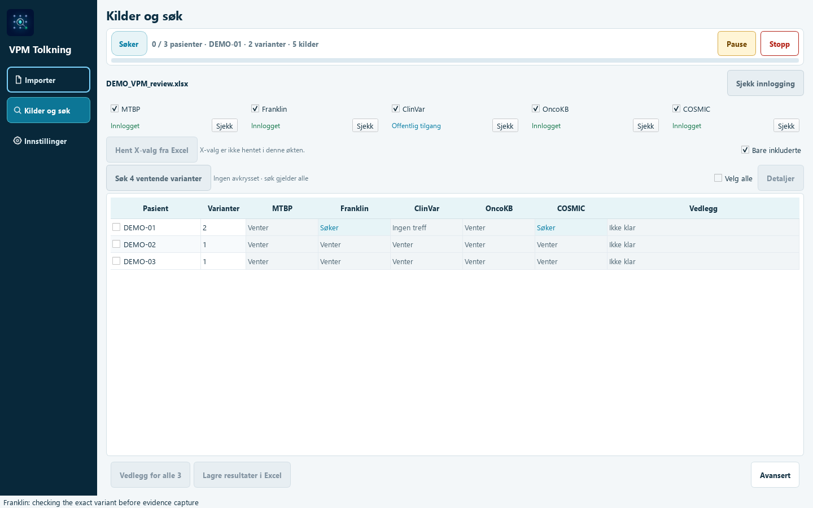
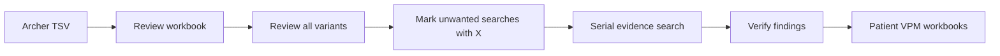

<p align="center">
  
</p>

<h1 align="center">VPM Tolkning</h1>

<p align="center">
  A focused Windows workstation for somatic variant review, evidence collection,<br>
  and image-led VPM interpretation reports.
</p>

<p align="center">
  
  
  
  
  
</p>

<p align="center">
  
</p>

<p align="center"><sub>Actual desktop UI with synthetic demonstration data. No live patient data or provider results.</sub></p>

> [!IMPORTANT]
> VPM Tolkning is a research and interpretation-support tool. Database findings
> and generated reports must be reviewed by qualified personnel before clinical use.

## What it does

VPM Tolkning turns an Archer Analysis TSV export into a controlled review and
evidence workflow. It keeps variant selection, browser research, screenshots,
audit data, and patient workbooks connected without sending patient or sample
identifiers to the evidence providers.

| Capability | Result |
| --- | --- |
| Structured import | Validates Archer TSV exports and normalizes variant records |
| Local prioritisation | Applies configurable artifact rules and Archer `Tier I`, `Tier II`, and `Germ` counts |
| Review-first workflow | Produces a full Excel workbook where unwanted searches can be marked with `X` |
| Evidence collection | Searches MTBP, Franklin, ClinVar, OncoKB, and COSMIC in minimized Microsoft Edge sessions |
| Screenshot capture | Saves focused, variant-specific evidence images in a consistent order |
| Resumable analysis | Reopens a processed workbook with selections, evidence, and screenshot paths restored |
| Patient reporting | Creates one image-led interpretation workbook per DIT identifier |

## Workflow


```mermaid
flowchart LR
    A["Archer TSV"] --> B["Review workbook"]
    B --> C["Review all variants"]
    C --> D["Mark unwanted searches with X"]
    D --> E["Serial evidence search"]
    E --> F["Verify findings"]
    F --> G["Patient VPM workbooks"]
```

1. Import an Archer variant TSV and create the review workbook.
2. Review **With Artifacts** and mark `X` in **Skip Database Search (X)** where appropriate.
3. Load the reviewed workbook back into the application.
4. Select the evidence sources. To handle urgent cases first, check one or more
   patients in **Kilder og søk** and use the main search button. Its label shows
   the checked scope. Their
   unfinished lookups run first and their reports are generated after the
   evidence workbook has been saved.
5. Verify and answer the prioritized reports, then clear the patient checkboxes
   and use the main search button to continue remaining work.
   Only patients with unfinished source lookups enter the second queue.
6. For a manual report run, check one or more patients, or leave all checkboxes
   clear for all patients. The **Vedlegg for …** button states its scope. Row
   focus only selects the patient shown in **Detaljer**. Reports are
   written to `VEDLEGG_APP` beside the review workbook as
   `<DIT>_VPM_Tolkning_APP.xlsx`.

Archer Analysis **v6 and v7** exports are supported. Import detects the version
from `Clinical Significance` (v6) or `ClinVar Significance` (v7) and writes the
selected version to the timestamped log. An unrecognised header set is logged as
unknown rather than guessed. V7's ClinVar field feeds the same interpretation
data as the v6 field; original source columns remain available in the workbook.

V7 review sheets use the column order and hidden columns from the supplied
2 October 2026 template, including `Run date`. They freeze through `Depth`
(`I1`, or `J1` with the app's skip-search selector). V6 keeps its existing layout.
Review selections and stored evidence survive saving and reopening either version.

Both versions use one shared artifact catalog: the existing 39 rules plus
12 unique additions from the v7 list. Existing settings receive these additions
without replacing local rules or AF overrides. Artifact matching ignores the
transcript accession's version suffix, while retaining its accession and exact
cDNA change. ASXL1 `NM_015338:c.1934dup` remains an artifact through **5.5% AF**,
with the existing lighter marking above 5% through 5.5%. The supplied workbooks
are reference inputs; patient and sample data from them are not bundled with the app.

Use **Pause** in the progress strip to pause at the next safe browser checkpoint
and **Fortsett** to continue the same queue without repeating completed work.
**Stopp** ends the run, retains every completed provider result, and updates the
review workbook whenever it is writable. The main search action skips fully
completed patients and sources, while retrying errors, timeouts, and unfinished
work. Log lines include clock timestamps and completed/stopped runs include total
elapsed time.

Automated Edge windows run minimized by default so the workstation remains usable.
Manual **Logg inn** windows still open visibly. Variant-to-variant pacing remains
randomized according to Settings; switching between providers uses a fixed 3-second
transition.

The compact native workstation has persistent left navigation for **Importer**,
**Kilder og søk**, and **Innstillinger**. The review workbook opens in the
computer's spreadsheet app. One progress strip contains Pause/Stop and the
patient count. The patient table takes the available space; report actions stay
visible below the scroll area. Additional retry and browser controls are under
**Avansert**. **Detaljer** updates when new evidence arrives.
Settings accepts an optional local `.xlsx`, `.csv`, or `.txt` WHO driver-gene list;
an empty path uses the bundled list, while an invalid path blocks saving with a clear error.
There is no duplicate activity panel or evidence matrix; the copyable, timestamped
log lives in **Importer**. Resume incomplete work from the main search action.
Startup can offer
the most recent local workbook, but it never loads data or contacts a provider
until **Gjenåpne** is selected under **Fortsett analyse · Excel**.
**Prøv ventende lagring igjen** retries only
locked report files and never repeats database searches.

The Import page also accepts a single local TSV or processed `.xlsx` dropped
onto **Slipp filen her**. Dropping a TSV prepares the input/output paths without
starting processing; dropping a workbook restores the existing analysis. After
creating the review file, use **Åpne i Excel**, review and save the X selections,
then **Til kilder og søk** and **Hent X-valg fra Excel**. The import action
advances after file creation instead of recreating the same workbook.
The current review filename remains visible on the search page.

Use **Sjekk innlogging** before a run to check all five dedicated Edge profiles.
Each source reports confirmed sign-in, public access (ClinVar), sign-in required,
unconfirmed access, or an error. The check does not enter credentials or submit
variants. Results show the time checked; hover a status for details. Choose the
source's **Logg inn** action when needed, then **Sjekk** again. These actions also
work when a selected reference file is unavailable. Checks and changes to
sources/import paths are disabled while an operation runs.

Evidence cells now update as each variant result is persisted, rather than
waiting for all variants at a provider. The table keeps selection, current cell
and scroll position; unselected sources without evidence show **Ikke valgt**.
Search startup brings patient progress into view. Small workstation windows
use horizontal table scrolling to keep patient identifiers and status text
readable. Workbook checkpoints remain grouped per patient.

## Editable reference lists

The supplied [Excel reference lists](reference_lists/README.md) contain the
current **51 artifact rules** and **54 WHO driver genes**, unchanged. Select
the files in **Innstillinger → Referanselister**, then **Lagre innstillinger**. Edit and
save those files in Excel to update the app without changing code. File-choice
edits are marked **Ikke lagret** until configuration saving succeeds.

A selected artifact workbook replaces the complete catalog at the next TSV
processing or analysis restore. Manual rules remain stored as the fallback
when no file is selected; the hardcoded defaults remain available. The WHO list
is read again whenever a review workbook or patient attachment is written.
Explicitly selected files with invalid rows, formulas, duplicate artifact keys
or unreadable content stop the operation with an actionable error.

## Evidence sources

All browser sources are queried with the somatic workflow and GRCh37/hg19 where
the provider exposes that choice.

| Source | Capture strategy | Key safeguards |
| --- | --- | --- |
| **MTBP** | One combined report per patient; full image in the MTBP sheet and local variant crops with section headings and A/B/C evidence | Gene + protein matching takes priority for crops, then cDNA when protein identity is unavailable. Unclear matches include all rows of that gene without an added image banner; the match scope remains in PNG metadata. Only rejected input variants use GRCh37 genomic fallback. |
| **Franklin** | Classification-only ACMG/Oncology overviews, each named evidence card, Predictions, and Population Frequencies | Explicit **hg19** + **Somatic** search; each ACMG/Oncology subtab gets a fixed one-second render buffer before capture; only the active panel is expanded, preserving the classification scale/score area without mixing pixels from the preceding tab; ACMG stops after De Novo Data; Somatic Clinical Evidence and Add More Evidence are excluded; blank or truncated captures are rejected and retried on resume |
| **ClinVar** | Variant title and focused germline/somatic classification summary | Searches gene with HGVSp first, then HGVSc, then gene with GRCh37 chromosome and position. The opened result must show the gene, GRCh37 position, and matching cDNA or protein change; older unverified results are queued for verification. |
| **OncoKB** | Variant Overview and Mutation Effect | Rejects the cookie overlay before taking the screenshot |
| **COSMIC** | Overview, Tissue distribution, and Samples filtered to `lymphoid` | Explicitly selects **GRCh37** in COSMIC's global Genome Version menu before searching and requires its active menu marker before capture. Canonical result redirects may omit the genome parameter, but any explicit genome value other than `37` is rejected. Tries every distinct COSM/COSV identifier from the Archer `COSMICID` column in source order; multiple candidates or an identity mismatch fail closed |

Patient report images are embedded in this order:

1. MTBP
2. Franklin
3. ClinVar
4. OncoKB
5. COSMIC

## Why direct Edge control?

The application controls the installed Microsoft Edge browser through the local
Edge DevTools Protocol (CDP). The browser is started and automated directly from
Python using a local WebSocket connection.

This design requires no:

- Playwright or Node.js
- Selenium or Selenium Manager
- separate Edge WebDriver executable

Each provider receives its own persistent Edge profile under
`%USERPROFILE%\.archer-prosess\browser_profiles`. This allows signed-in sessions
to be reused while keeping browser activity visible and auditable.

Startup checks managed Edge policy before opening a profile. Disabled remote
debugging, a mandatory profile-directory override, unreadable policy, or an
already-owned evidence profile produce an actionable error. No policy or
certificate settings are changed. See [workstation validation](docs/workstation-improvements.md)
for the work-PC checks and remaining live-environment validation.

> [!WARNING]
> Browser profiles contain authenticated session data. Do not copy, share, or
> commit the profile directory. Managed Edge must permit local remote debugging.

## Operational safeguards

- Patients run serially; all selected websites finish before the next patient begins.
- Different providers use at most four parallel lanes: ClinVar, Franklin,
  MTBP, and a serial fast-database lane for COSMIC and OncoKB.
- Variants within a provider remain serial and each provider keeps its isolated
  Edge profile. The application never opens concurrent sessions to one provider.
- Randomized safety buffers default to 3–8 seconds between variant lookups.
- MTBP has a separately configurable report timeout.
- MTBP submissions use application-generated pseudonymous identifiers only.
- Completed patient evidence is saved throughout the run, not only at the end.
- Cooperative cancellation is checked during provider loops, safety buffers,
  Franklin rendering waits, and MTBP report polling.
- If Excel has the workbook open, the app keeps evidence in memory, shows a clear
  warning, and allows the workbook update to be retried without closing the app.
- Large processed workbooks are restored in a background thread with progress,
  keeping the application responsive.
- Blank, truncated, missing, or otherwise incomplete required screenshots are
  marked for recapture instead of being treated as complete evidence.
- Screenshot filenames use hashes or pseudonymous report identifiers rather than
  patient or sample identifiers.

## Excel outputs

### Review workbook

The first output is designed for complete variant review and database selection.
It contains exactly two data sheets:

- **With Artifacts** — the full variant list, including **Skip Database Search (X)**.
- **Artifacts Removed** — the corresponding view without known artifacts.

The workbook mirrors the laboratory review layout with frozen identifier columns,
hidden low-priority technical fields, familiar row colours,
and `Run_dato` at the far right, derived from a `YYYY_MM_DD_VPM` input or output file name or folder when present. Database results are kept in a very hidden
storage sheet so a review session can be resumed without visible search columns.
AF remains numeric, is shown as a percentage, and is sorted from highest to
lowest within each patient.

### Patient workbooks

Patient reports are named `<DIT>_VPM_Tolkning_APP.xlsx` (for example,
`26OUM12345_VPM_Tolkning_APP.xlsx`) and contain:

- **Oversikt** — compact findings such as `ClinVar – Benign`, plus source links,
  a manual **Kommentar** column, and a manual `HSMD -` line. Kommentar and HSMD
  text follow the variant when a workbook is regenerated and AF order changes.
  A pale-orange merged **D3:L4** box holds patient-level comments and is preserved
  on regeneration. Patient number and sequencing date occupy rows 3 and 4.
  The WHO driver-gene column sits to the right of gnomAD. The COSMIC-ID column
  shows the Archer COSMIC ID with a link, or **Ikke ID i Archer** when absent.
- **MTBP** — the combined MTBP report without the portal/header intro above the Genomics content. The original full screenshot remains in the local evidence directory. The sheet keeps visible gridlines and four light guide rows above the report.
- **One sheet per variant** — linked compact evidence followed by embedded screenshots with plain, non-linked captions.

Unique genes use the gene symbol as the sheet name. If a patient has multiple
variants in the same gene, the protein change is added; the coding-DNA change is
used when protein information is unavailable.

Patient reports are generated **only when the report button is pressed**, not
automatically during database searches. Existing evidence and screenshot paths
are reused. Close the target workbook in Excel before regenerating it; locked
report saves can be retried with **Retry Pending Saves** without repeating searches.

## Resume a previous analysis

Use **Open Processed Workbook** on the Import page to continue after restarting
the application. The loader restores:

- all original variant rows;
- current include/exclude decisions;
- `X` selections from **With Artifacts**;
- compact database evidence;
- matching screenshot and audit paths from the `*_browser_evidence` directory.

New searches merge with restored evidence instead of discarding earlier results.
Errors, timeouts, identity mismatches, unverified ClinVar records, and partial
captures remain pending when the main search action resumes unfinished work.

## Priority colours

Artifact colouring always takes precedence. Non-artifact rows are highlighted:

- strong orange for `ASXL1 NM_015338.5:c.1934dup` through 5.0% AF;
- light orange for the same ASXL1 variant above 5.0% through 5.5% AF;

- strong green when `Germ > 10` and AF is at least 35%;
- weak green when `Germ > 10` and AF is below 35%;
- uncoloured with a warning when `Germ > 10` but AF is missing.

Both green Germline categories are automatically excluded from every database
search. A Germline row with missing AF remains uncoloured and is not automatically
excluded because it cannot be assigned to either green category.

Tier I and Tier II counts do not affect row colouring.

## Requirements

- Windows 10 or Windows 11
- Python 3.11 or newer
- Microsoft Edge with the `RemoteDebuggingAllowed` policy enabled
- Access to the provider websites required by your workflow
- Microsoft Excel for manual workbook review and final adjustments

## Installation

```powershell
git clone https://github.com/Christian-Bjornstad/Archer-prosess.git
cd Archer-prosess

py -3.11 -m venv .venv
.\.venv\Scripts\Activate.ps1
python -m pip install --upgrade pip
python -m pip install -e ".[dev]"
```

Start the application with either command:

```powershell
vpm-tolkning
# or
python -m archer_processor
```

## Configuration

Use the in-app **Innstillinger** page to configure:

- default output directory;
- provider sign-in details;
- browser safety-buffer range;
- minimized/background Edge mode;
- MTBP timeout and cancer type;
- local artifact rules. The defaults contain the 36 `HGVSc` entries from
  **Artefakter DNA Fragmentering v2** plus the three v1-only CEBPA entries
  `c.288C>G`, `c.280G>C`, and `c.296G>C`; `NM_015338.5:c.1934dup` is treated as
  an artifact through 5.5% AF and retained above that threshold;
- default evidence sources.

Non-secret settings are stored in `%USERPROFILE%\.archer-prosess\config.json`.
Passwords are excluded from that JSON file and handled through the operating
system credential store.

## Development

Run the full automated test suite:

```powershell
pytest -q
```

Exercise capture geometry against local synthetic HTML in real Edge, without
contacting evidence providers:

```powershell
$env:PYTHONPATH = "$PWD/src"
python scripts/verify_capture_locally.py
```

Refresh the README screenshot from the real PyQt interface with synthetic data:

```powershell
python scripts/render_readme_screenshot.py
```

Project layout:

```text
src/archer_processor/
├── core/       Variant models, filtering, and processing
├── gui/        PyQt6 desktop interface and workers
├── io/         Archer TSV import
├── knowledge/  Historical variant matching
├── reports/    Review and patient Excel generation
├── services/   Browser automation, providers, settings, and resume support
└── assets/     Application icon resources

tests/          Unit and workflow regression tests
docs/           Workflow and design notes
design-system/  VPM Tolkning visual and interaction rules
```

## Status

VPM Tolkning is under active development for a specialised laboratory workflow.
Provider websites can change without notice, so browser selectors and evidence
boundaries are intentionally fail-closed and covered by regression tests wherever
possible.

See [capture and concurrency notes](docs/mtbp-capture-and-concurrency.md) for the
MTBP fallback policy and the bounded provider concurrency model.
